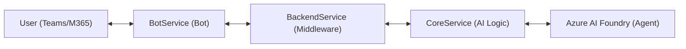

# M365 to Azure AI Foundry End-to-End Sample

This repository demonstrates an end-to-end integration pattern connecting a **Microsoft 365 Copilot Agent** (using Azure Bot Service) to an **AI Agent** hosted in **Azure AI Foundry**. The solution enables real-time streaming responses from an AI agent back to M365 components (like Microsoft Teams).

## Architecture

The solution relies on a chained architecture to separate concerns between the Bot handling (M365 protocol) and the core AI logic.



### Components

1.  **BotService (Bot Frontend)**
    *   **Technology**: .NET 9, Microsoft Agents SDK.
    *   **Role**: Handles the Bot Framework activity protocol (`/api/messages`). It receives messages from the user, forwards them to the backend, and streams the AI response back to the user in chunks.
    *   **Configuration**: Supports Azure Bot Service authentication and managed identity.

2.  **BackendService (Middleware)**
    *   **Technology**: .NET.
    *   **Role**: Acts as a bridge between the Bot project and the Core AI service. It listens on port `5000` (default) and proxies requests to the Core service.
    *   **Key Feature**: Handles strict JSON contracts and manages Server-Sent Events (SSE) streaming for response generation.

3.  **CoreService (AI Logic)**
    *   **Technology**: **Python**: `CoreService` using FastAPI and `agent-framework-azure-ai`.
    *   **Role**: Connects directly to **Azure AI Foundry**. It executes the Agent logic, runs tools (e.g., specific business logic tools like `get_daily_tasks`), and streams the answer back.
    *   **Default Port**: `8000`.

## Prerequisites

*   **Azure Account** with an active subscription.
*   **Azure AI Foundry Project**: You need an existing project and an Agent created in the Foundry.
*   **Development Environment**:
    *   [.NET 9.0 SDK](https://dotnet.microsoft.com/download/dotnet/9.0)
    *   [Python 3.10+](https://www.python.org/) (if using the Python Core Service)
    *   Visual Studio 2022 or VS Code with C# Dev Kit.

## Setup and Running

To run the solution locally, you need to start the services in the reverse order of dependency (Core -> Backend -> Bot), or all together.

### 1. Configure and Run the Core Service

1.  Navigate to `CoreService`.
2.  Create a virtual environment and install dependencies:
    ```bash
    python -m venv .venv
    source .venv/bin/activate # or .venv\Scripts\activate on Windows
    pip install -r requirements.txt
    ```
3.  Create a `.env` file with your Azure AI Foundry details:
    ```env
    AIServices:AzureAIFoundryProjectEndpoint="https://<your-project>.services.ai.azure.com/api/projects/<your-project-id>"
    AIServices:ChatAgentID="<your-chat-agent-name>"
    AIServices:BuilderAgentID="<your-builder-agent-name>"
    ```
4.  Run the service:
    ```bash
    uvicorn main:app --host 0.0.0.0 --port 8000
    ```

### 2. Run the Backend Service

1.  Navigate to `BackendService`.
2.  Run the project:
    ```bash
    dotnet run
    ```
    Ensure it is listening on `http://localhost:5000`.

### 3. Run the Bot Service (`BotService`)

1.  Navigate to `BotService`.
2.  Configure `appsettings.json` or User Secrets with your Bot credentials if deploying to Azure. For local testing with emulators, default settings might suffice.
3.  Run the project:
    ```bash
    dotnet run
    ```
    Ensure it is listening on `http://localhost:5130`.

## Testing

Use the **Agents Playground** to test the bot. For setup instructions, see [Test with Teams Toolkit project](https://learn.microsoft.com/en-us/microsoft-365/agents-sdk/test-with-toolkit-project?tabs=windows).

Run the following command in your terminal:

```bash
agentsplayground -e "http://localhost:5130/api/messages" -c "emulator"
```

1.  Send a message (e.g., "What are my daily tasks?").
2.  The Bot forwards it -> Backend -> Core -> AI Foundry.
3.  The agent processes the request (potentially calling the `get_daily_tasks` tool defined in `main.py`).
4.  The response is streamed back text-by-text to the chat window.

### Testing with Insomnia

You can also test the `BackendService` directly using an API client like Insomnia. This is useful for debugging the AI logic without involving the Bot Framework layer.

1.  In Insomnia, create a new **Event Stream Request (SSE)**.
2.  Set the method to **POST** and the URL to the backend service endpoint: `http://localhost:5000/api/v1/messages`.
3.  **Set the request body** to JSON with the following payload:
    ```json
    {
      "conversation": {
        "id": "55c737d5-db10-41bc-997f-1fae97339b92"
      },
      "text": "Who are you?"
    }
    ```
4.  **Send the request**. You should see the response from the agent streamed back in the Events tab.

## License
MIT
